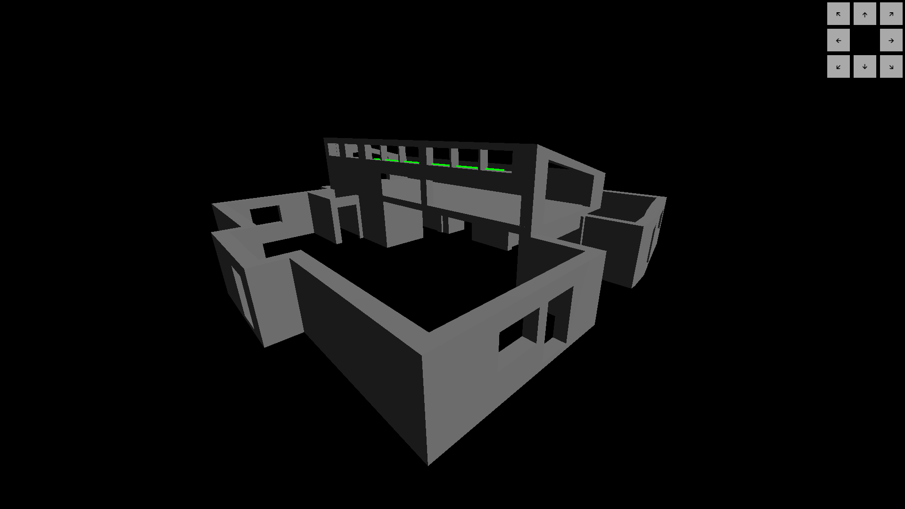

# LITL

## Example



## Konfiguration

Die Konfiguration sollte über das <b>elements-Array</b> stattfinden.

Die ersten Attribute beziehen sich auf die Eigenschaften des Elements in der 3D-Ansicht.
```
...baseElement, // Gibt eine Art Vererbungshierarchie 
geometry: {
    x: 0.1,
    y: 8,
    z: 0.1
},
material: {
    color: 0x00ff00
},
position: {
    x: -1.4,
    y: 0,
    z: 4.5
},
rotation: {
    x: 0,
    y: 0,
    z: 0.039
},
```

Die Funktionen sollten für jeden Element angepasst werden und beschreiben wie sich das Element bei verschiedenen Aktionen verhalten soll.

```
init: async function() {
    // Code wird automatisch als letzter Schritt der Initialisierung aufgerufen
},
state: async function () {
    // Code toggelt den aktuellen Status des Elements
},
color: async function () {
    // Code aktualisiert die Farbe durch Zugriff auf this.treeElement.material.color.set(0xff0000);
}
```

## Fehlerbehebung

Wichtig: Weicht hier ein Wert vom Base Element ab, müssen auch die anderen Werte belegt werden: 

NICHT: 
``` 
...baseElement,
geometry: {
    x: 0.1
},
...
``` 

SONDERN: 
``` 
...baseElement,
geometry: {
    ...baseElement.geometry,
    x: 0.1
},
``` 
oder
``` 
...baseElement,
geometry: {
    x: 0.1,
    y: 0,
    z: 0,
},
```